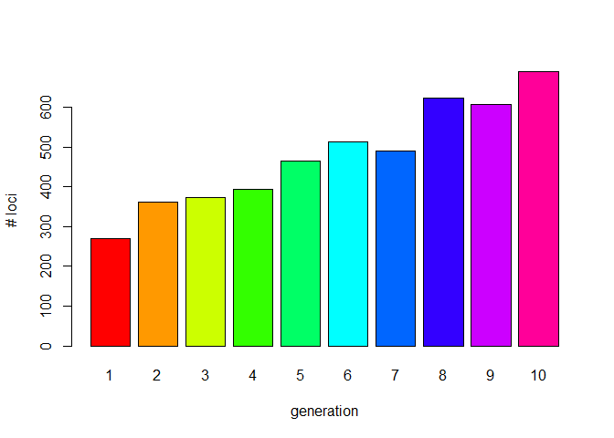

<!-- README.md is generated from README.Rmd. Please edit that file -->

# slimr 

<https://rdinnager.github.io/slimr/>

<!-- badges: start -->

[](https://github.com/rdinnager/slimr/actions)
[](https://www.tidyverse.org/lifecycle/#maturing)
[](https://rdinnager.r-universe.dev/slimr)
<!-- badges: end -->

The goal of `slimr` is to run SLiM population genetics forward
simulations from R. It also has utilities for monitoring the
simulations, and bringing the resulting data into R for post-processing
and visualization.

## Setup

To be able to use `slimr` productively it is important to have a working
version of [SLiM](https://messerlab.org/slim/) and `slimr`.

### Installing slimr and SLiM

As a first step you need to install the package `slimr` from github.

``` r

if (!require("devtools")) install.packages(devtools)
devtools::install_github("rdinnager/slimr")  #downloads the latest version

#for other branches you may want to try
devtools::install_github("rdinnager/slimr", re = "v0.2.1")  #version accompanied with the manuscript
```

`slimr` is also on R-Universe, and can be installed alternatively using
the following code:

``` r
install.packages('slimr', repos = c('https://rdinnager.r-universe.dev', 'https://cloud.r-project.org'))
```

To facilitate the installation of slim We provide provide a function
`slim_setup()`. This functions aims to download a precompiled binary of
SLiM and automatically links slimr to SLiM. Unfortunately due to the
variety of systems and installs this might not work. If that is is the
case please follow the excellent documentation how to install SLiM on
their websites.

- [Windows](http://benhaller.com/slim/SLiM_Manual.pdf#page=64)
- [Linux](http://benhaller.com/slim/SLiM_Manual.pdf#page=59)
- [MacOS](http://benhaller.com/slim/SLiM_Manual.pdf#page=54)

## A first test run

The next step is to make sure `slimr` is “linked” to slim (by knowing
the location of the folder where the slim program is installed.). To
check you can try:

``` r
slimr::slim_is_avail()
#> [1] TRUE
```

And if true is returned you are ready to go and run the test example
below. In the case the test was not successful we need to find the path
where the slim executable has been installed and set this path in the R
environment accordingly.

For example if SLiM is installed at
`C:/Program Files/R/R-4.3.1/library/slimr` then you need to specify this
via:

``` r
Sys.setenv(SLIM_PATH='C:/Program Files/R/R-4.3.1/library/slimr/slim.exe')
```

If you want to add this path permanently to your RStudio installation
(so no need to run `Sys.setenv()` every time) you can use the command
`usethis::edit_r_environ()` and add a line like
`SLIMR_PATH='C:/Program Files/R/R-4.3.1/library/slimr'` to this file.

## Run a first simple test

To be able to run SLiM within slimr we need to create a simple slim
script. Below is the `slimr` version of the first slim script as
presented in the excellent [SLiM](https://messerlab.org/slim/) manual,
called receipes. There are hundreds of more advanced script and we
provide also several worked out examples in the manuscript (Russell et
al. submitted,
[bioRxiv](https://www.biorxiv.org/content/10.1101/2021.08.05.455258v2)
). The example below is simply to test if slim is installed correctly
and works together with `slimr`.

Running this code should give you the output as below (a return value of
zero means success).

``` r
library(slimr)
#> Welcome to the slimr package for forward population genetics simulation in SLiM. For more information on SLiM please visit https://messerlab.org/slim/ .
#> 
#> Attaching package: 'slimr'
#> The following object is masked from 'package:methods':
#> 
#>     initialize
#> The following object is masked from 'package:base':
#> 
#>     interaction

slim_script(
  slim_block(initialize(),
             {
               ## set the overall mutation rate
               initializeMutationRate(1e-7); 
               ## m1 mutation type: neutral
               initializeMutationType("m1", 0.5, "f", 0.0);
               ## g1 genomic element type: uses m1 for all mutations
               initializeGenomicElementType("g1", m1, 1.0);
               ## uniform chromosome of length 100 kb
               initializeGenomicElement(g1, 0, 99999);
               ## uniform recombination along the chromosome
               initializeRecombinationRate(1e-8);
             }),
  slim_block(1,
             {
               sim.addSubpop("p1", 500);
             }),
  slim_block(10000,
             {
               sim.simulationFinished();
             })
) -> script_1

script_1
#> <slimr_script[3]>
#> block_init:initialize() {
#>     initializeMutationRate(1e-07);
#>     initializeMutationType("m1", 0.5, "f", 0);
#>     initializeGenomicElementType("g1", m1, 1);
#>     initializeGenomicElement(g1, 0, 99999);
#>     initializeRecombinationRate(1e-08);
#> }
#> 
#> block_2:1 early() {
#>     sim.addSubpop("p1", 500);
#> }
#> 
#> block_3:10000 early() {
#>     sim.simulationFinished();
#> }

#run slim from within slimr
slim_run(script_1)
#> 
#> 
#> Simulation finished with exit status: 0
#> 
#> Success!
```

`slimr` shines because it can create so called templates to run scripts
with different parameter settings. It also allows to “collect” the
output from SLiM and load it back into R, so you can run a full
simulation with lots of parameters settings using parallel cores if
available and analyse the output directly in R.

See the vignettes for details of these features and how to use them.

## A complete workflow

Below is a simple “complete” workflow. \* Creating a script in R \* Run
SLiM \* Load the results into R \* Analyse and visualise the results.

As an example we simply will run a single population of 33 individuals
for 100 generations, with a single chromosome of (length=100000 bases),
and high mutation rate (1e-5) \[to shorten run-time\]. Every 10
generation we will save the genetic status of each individual for 100
generations. Once completed we read back in the genotypes (as a genlight
object) and count the number of loci every of the 10 generations (the
number of loci increases due to the mutations, that occurs during the
simulation.

``` r
library(slimr)
# package adegenet as we are using genlight objects
if (!require(adegenet)) install.packages("adegenet")
#> Loading required package: adegenet
#> Loading required package: ade4
#> 
#>    /// adegenet 2.1.10 is loaded ////////////
#> 
#>    > overview: '?adegenet'
#>    > tutorials/doc/questions: 'adegenetWeb()' 
#>    > bug reports/feature requests: adegenetIssues()
library(adegenet)

slim_script(
  slim_block (initialize(),
  {
    initializeMutationRate(1e-5);
    ## m1 mutation type: neutral
    initializeMutationType("m1", 0.5, "f", 0.0);
    ## g1 genomic element type: uses m1 for all mutations
    
    initializeGenomicElementType("g1", m1, 1.0);
    ## uniform chromosome of length 100 kb
    initializeGenomicElement(g1, 0, 99999 );
    ## uniform recombination along the chromosome
    initializeRecombinationRate(1e-8);
  }),
  slim_block(1, early(),
    {
    ## create a population of 33 individuals
    sim.addSubpop("p1", 33);
    }),
  
  slim_block(1, 100, late(), 
    {
      #create an output 
      slimr_output(p1.genomes.output(), "p1", do_every=10);
    }),
  
    
  slim_block(100,late(),

    {
    sim.simulationFinished();
    })


)->script_2
```

As before we setup a script, but this time we would like to run SLiM in
parallel (does not make much sense as it is a single run only, but this
is for demonstration purposes)

``` r
library(future)
# we want to run SLiM using 5 local cores
# please note on Linux and Windows you would like to use multicore as this is faster as it is a 'real' fork, 
# but multisession works on all systems
plan(multisession, workers = 5)
sr <- slim_run(script_2 , parallel = TRUE)
#> 
#> 
#> Simulation finished with exit status: 0
#> 
#> Success!
```

And finally we want to get the results back into R. The `sr` object has
information on all the runs and output files and data and can be used to
get the results directly back into R. Please note that SLiM will still
produce all the output files it as if it would have been run from the
command line, hence the user can also explore those files.

In a typical slimr workflow though the user wants to have the data
loaded back into R and depending on the output (in this case we used the
function `genomes.output()` to save) we can easily create `genlight`
objects that hold the genomics data in a very memory efficient way. To
do so we use the `slim_extract_genlight` function.

Before we use this function we may want to explore the `sr` object which
is a tibble that holds all the information that was used during runs.

``` r
str(sr)
#> List of 6
#>  $ output     : chr [1:42] "// Initial random seed:" "1451368211" "" "// RunInitializeCallbacks():" ...
#>  $ exit_status: int 0
#>  $ output_data: slmr_tp_ [10 × 5] (S3: slimr_output_data/spec_tbl_df/tbl_df/tbl/data.frame)
#>   ..$ generation: int [1:10] 10 20 30 40 50 60 70 80 90 100
#>   ..$ name      : chr [1:10] "p1" "p1" "p1" "p1" ...
#>   ..$ expression: chr [1:10] "p1.genomes.output()" "p1.genomes.output()" "p1.genomes.output()" "p1.genomes.output()" ...
#>   ..$ type      : chr [1:10] "slim_output" "slim_output" "slim_output" "slim_output" ...
#>   ..$ data      : chr [1:10] "#OUT: 10 GS 66\nMutations:\n5 3 m1 34932 0 0.5 p1 1 7\n85 10 m1 59907 0 0.5 p1 1 11\n87 11 m1 73352 0 0.5 p1 1 "| __truncated__ "#OUT: 20 GS 66\nMutations:\n33 10 m1 59907 0 0.5 p1 1 9\n34 11 m1 73352 0 0.5 p1 1 9\n62 17 m1 92598 0 0.5 p1 1"| __truncated__ "#OUT: 30 GS 66\nMutations:\n259 10 m1 59907 0 0.5 p1 1 5\n262 11 m1 73352 0 0.5 p1 1 5\n363 38 m1 55142 0 0.5 p"| __truncated__ "#OUT: 40 GS 66\nMutations:\n145 10 m1 59907 0 0.5 p1 1 6\n152 11 m1 73352 0 0.5 p1 1 6\n25 47 m1 46832 0 0.5 p1"| __truncated__ ...
#>   ..- attr(*, "spec")=
#>   .. .. cols(
#>   .. ..   generation = col_integer(),
#>   .. ..   name = col_character(),
#>   .. ..   expression = col_character(),
#>   .. ..   type = col_character(),
#>   .. ..   data = col_character()
#>   .. .. )
#>   ..- attr(*, "problems")=<externalptr> 
#>  $ process    :Classes 'process', 'R6' PROCESS 'slim.exe', finished.
#>  
#>  $ error      : chr(0) 
#>  $ output_file: chr "F:\\Rtemp\\RtmpG8bC0h\\file2d6c47b718ae.txt"
#>  - attr(*, "class")= chr "slimr_results"

sr$output_data
#> # A tibble: 10 × 5
#>    generation name  expression          type        data                        
#>         <int> <chr> <chr>               <chr>       <chr>                       
#>  1         10 p1    p1.genomes.output() slim_output "#OUT: 10 GS 66\nMutations:…
#>  2         20 p1    p1.genomes.output() slim_output "#OUT: 20 GS 66\nMutations:…
#>  3         30 p1    p1.genomes.output() slim_output "#OUT: 30 GS 66\nMutations:…
#>  4         40 p1    p1.genomes.output() slim_output "#OUT: 40 GS 66\nMutations:…
#>  5         50 p1    p1.genomes.output() slim_output "#OUT: 50 GS 66\nMutations:…
#>  6         60 p1    p1.genomes.output() slim_output "#OUT: 60 GS 66\nMutations:…
#>  7         70 p1    p1.genomes.output() slim_output "#OUT: 70 GS 66\nMutations:…
#>  8         80 p1    p1.genomes.output() slim_output "#OUT: 80 GS 66\nMutations:…
#>  9         90 p1    p1.genomes.output() slim_output "#OUT: 90 GS 66\nMutations:…
#> 10        100 p1    p1.genomes.output() slim_output "#OUT: 100 GS 66\nMutations…
```

Now we can use the `slim_extract_genlight` function to convert the SLiM
output files back into R, which creates a list of 10 genlight objects,
one for each generation.

``` r


gls<- slim_extract_genlight(sr, by=c("generation"))
gls
#> # A tibble: 10 × 2
#>    generation genlight        
#>         <int> <list>          
#>  1         10 <genlight[,237]>
#>  2         20 <genlight[,337]>
#>  3         30 <genlight[,397]>
#>  4         40 <genlight[,405]>
#>  5         50 <genlight[,444]>
#>  6         60 <genlight[,474]>
#>  7         70 <genlight[,510]>
#>  8         80 <genlight[,547]>
#>  9         90 <genlight[,456]>
#> 10        100 <genlight[,559]>


#the genlight object for generation 10
gls$genlight[[1]]
#>  /// GENLIGHT OBJECT /////////
#> 
#>  // 33 genotypes,  237 binary SNPs, size: 70.3 Kb
#>  0 (0 %) missing data
#> 
#>  // Basic content
#>    @gen: list of 33 SNPbin
#> 
#>  // Optional content
#>    @ind.names:  33 individual labels
#>    @loc.names:  237 locus labels
#>    @position: integer storing positions of the SNPs
#>    @other: a list containing: mut_type  prevalence

#number of loci at generation 10
nLoc(gls$genlight[[1]])
#> [1] 237
```

And finally we can use a simply `lapply` to find the number of loci in
the genlight for each generation (e.g. the number of loci that are
polymorphic).

``` r


nloci <- unlist(lapply(gls$genlight, nLoc))
barplot(nloci, col=rainbow(length(gls$genlight)), names.arg = 1:10, xlab="generation",
        ylab="# loci")
```



As we expect, this value gradually increases over time.

Within a simulation, it is also possible to output any file format or
intermediate result in a variety of common and self-defined formats,
(e.g VCF files, Fst values or a pedigree trees) and then extract the
information using the workflow outlined above.

A very important feature, not shown here, is that you can create so
called template scripts that have placeholders for parameters, that can
be filled via a R data structure and all run all simuations via a single
call to SLiM using `slim_run()`. Please see the vignettes for such an
example.

We believe that a simplified workflow will allow researchers to explore
their parameter space in more detail and therefore, ultimately, will
lead to a better understanding of the system under study.

Have fun using `slimr`!!!

Russell et al.

(Thanks to Bernd Gruber for making the above example script!)

## Code of Conduct

Please note that the `slimr` project is released with a [Contributor
Code of
Conduct](https://contributor-covenant.org/version/2/0/CODE_OF_CONDUCT.html).
By contributing to this project, you agree to abide by its terms.

## A Note on Autocomplete

Autocomplete is supported for SLiM code used within `slimr`, though with
some unavoidable limitations. More specifically, autocomplete is
normally limited to the suggestions of the names of existing functions
and arguments. This creates a complication for functions that are
methods within SLiM classes (the majority of functions since SLiM is an
object-oriented language). This is because the operator to access
elements inside an object in SLiM is `.` (similar to Python), but in R
`.` is not an operator, R assumes the `.` is part of the name of an
object. This means if you type `sim.addSubpop`, R will not recognize
`addSubpop` as a function to look up for autocompletion.

In `slimr`, there are two ways you can get around this limitation for
accessing autocomplete for methods from within R. The simplest way that
results in the most readable code is to use the `slim_load_globals()`
function. When run this function will load object stubs for commonly
used SLiM class instances into the R global environment. This includes
the `sim` object, which is the main SLiMSim class instance used to track
the simulation from within SLiM (or an instance of class Species in SLiM
4.0 or greater, where it represents the main species simulation in a
single species simulation). It can also load as many numbered global
variables used in SLiM as desired, named as in SLiM like `p1`, `p2`,
`…`, `pn` for the first n Subpopulations, `g1`, `g2`, `…`, `gn` for
GenomicElementTypes, etc (see documentation of `slim_load_globals()` for
details). Functions (or properties) can then be accessed within these
instances using the standard R `$` operator for accessing elements of a
list. For convenience, slimr converts any `$` in SLiM code into `.`,
allowing you to leave the code as is after autocompletion has been used.

The second method is less readable but avoids having to load otherwise
unnecessary objects into your global environment. To use it, you type
the object name followed by the R operator %.%, which is included in
slimr, they then type the class name of the object (such as Genome, or
SLiMSiM) and then using the `$` operator, methods and properties of that
class can be accessed and autocompleted. An example would be
`sim%.%Species$addSubpop()`. This is a little verbose so `slimr` also
includes abbreviated versions of all SLiM classes. For Species the
abbreviation is `Sp`, so you could type `sim%.%Sp$addSubpop()`. Just as
for the other solution, `slimr` knows how to properly replace the above
code with the correct SLiM code, which would be `sim.addSubpop()`. See
the below figure for a screenshot of both the methods in action in the
RStudio IDE.


*Caption: Screenshots of working with slimr autocomplete in RStudio,
which requires some special consideration due to the object oriented
programming style of SLiM. a) An example of autocomplete for SLiM code
using the `slim_load_globals()` function which loads a set of objects
that store what SLiM classes contain, in this case the sim object, which
is a SLiM 4.0 Species class. This lets the user press tab to bring up
the arguments of `addSubpop()` function, which is a method of Species.
The lower panel shows that `slimr` automatically replaces the expression
with the correct SLiM code. b) An example of using the alternative
method for autocomplete by typing the name of an object (`sim`),
followed by `%.%` and then the class name or an abbreviation of the
class name (`Sp`), and then using `$` to access methods or properties of
the class. Again, the lower panel shows how `slimr` correctly replaces
the construction with valid SLiM code. By prefixing any of the methods
or properties inside the `slimr` class objects with `?`, you can also
bring up the full documentation of the method or property from the SLiM
manual.*
