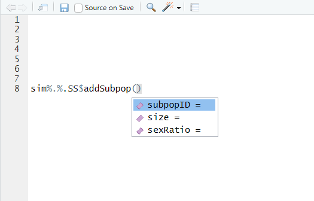

```{r, include = FALSE}
knitr::opts_chunk$set(
  collapse = TRUE,
  comment = "#>",
  warning = FALSE
)

```

```{r color, echo = FALSE, results='asis'}
# crayon needs to be explicitly activated in Rmd
options(crayon.enabled = TRUE)
# Hooks needs to be set to deal with outputs
# thanks to fansi logic
if(requireNamespace("fansi", quietly = TRUE)) {
  old_hooks <- fansi::set_knit_hooks(knitr::knit_hooks, 
                                     which = c("output", "message", "error"))
}
```

This vignette introduces the `slimr` package. `slimr` has the goal of making it easy to write scripts for the population genetics simulation software and programming language [SLiM](https://messerlab.org/slim/). `slimr` offers tools to get R objects and generated model parameters into SLiM, as well as to help SLiM generate R friendly output for post-simulation analysis. It also provides tools for working with existing SLiM scripts as well as running, monitoring, and visualising SLiM simulations in realtime and directly from R, as well as post-processing in R.

# Writing SLiM Scripts

To write a SLiM script in `slimr` you must wrap your SLiM code in `slim_block` function calls, which are then nested in a `slim_script` function call. The API for `slimr` has been designed to mimic as close as possible the way that scripts are written in SLiM itself. To get you started we will use an example. SLiM has an extremely extensive manual that includes a large number (around 150!) of example scripts to help users learn the language. We will take advantage of this resource and try to write a few of the manual's scripts using the `slimr` approach.

This is the first SLiM script (referred to as 'recipes') in the SLiM manual:

```
// set up a simple neutral simulation
initialize()
{
  // set the overall mutation rate
  initializeMutationRate(1e-7);
  // m1 mutation type: neutral
  initializeMutationType("m1", 0.5, "f", 0.0);
  // g1 genomic element type: uses m1 for all mutations
  initializeGenomicElementType("g1", m1, 1.0);
  // uniform chromosome of length 100 kb
  initializeGenomicElement(g1, 0, 99999);
  // uniform recombination along the chromosome
  initializeRecombinationRate(1e-8);
}
// create a population of 500 individuals
1
{
  sim.addSubpop("p1", 500);
}
// run to generation 10000
10000
{
  sim.simulationFinished();
}
```

So how would we write this script in `slimr`? Like this:

```{r first_script}
library(slimr)

slim_script(
  slim_block(initialize(),
             {
               ## set the overall mutation rate
               initializeMutationRate(1e-7); 
               ## m1 mutation type: neutral
               initializeMutationType("m1", 0.5, "f", 0.0);
               ## g1 genomic element type: uses m1 for all mutations
               initializeGenomicElementType("g1", m1, 1.0);
               ## uniform chromosome of length 100 kb
               initializeGenomicElement(g1, 0, 99999);
               ## uniform recombination along the chromosome
               initializeRecombinationRate(1e-8);
             }),
  slim_block(1,
             {
               sim.addSubpop("p1", 500);
             }),
  slim_block(10000,
             {
               sim.simulationFinished();
             })
) -> script_1

script_1
```

It is as simple as that at its most basic. `slim_script` returns a `slimr_script` object which has a print method that prints out the final SLiM script in a pretty fashion. You can see that the output above is quite similar to the original SLiM code from the manual recipe. The one difference is the block names, highlighted in cyan. These are added internally by `slimr` to keep track of code blocks. These names can be used in some other `slimr` functions, for example, to refer to particular code blocks for modification. You can also add block 'ids' inside of SLiM code, which can be referred to within SLiM code. These are also fully supported by `slimr` and are kept track of alongside the `slimr` code block names. More on this later.

The SLiM language is similar enough to R that most of it works out of the box without any modification. However, there are a few places that SLiM is different enough that `slimr` has had to put in some slight modifications. We will learn about these differences throughout this vignette. At the moment however, let's go through the typical structure of a SLiM script and the `slimr` version of it. 

Now, the script above is just the simplest way to write a SLiM script in R, which is mostly just verbatim using the SLiM language syntax. However, if you write your script this way, you will have to be very familiar with the SLiM language, something which I personally am not yet. In order to make it easier to write SLiM scripts in R, `slimr` offers real-time code completion and SLiM function documentation. In order to make this work within R however, you will need to code your SLiM scripts slightly differently. This is a consequence of the object-oriented approach of SLiM, which makes heavy use of classes, methods and properties. Because R does not know the classes of object which will only be determined after the script is run within SLiM, you, the user, must specify what class an object is in order for R to know what functions and properties are available to that class, to enable autocompletion. To do this you can make use of the special operator `%.%`, which mimics the `.` operator within SLiM. SLiM, like Python, uses the `.` operator to specify that a method or property after the `.` belongs to the object before the `.`. It plays a similar role to that of `$` in R. An example of this in the above script is these lines:

```
sim.addSubpop("p1", 500);
```

and

```
sim.simulationFinished()
```

In SLiM, `sim` is a global object of class `SLiMSim`, which has a number of methods and properties associated with it. You can rewrite the above statements in `slimr` in the following way, which will then allow you to use autocompletion:

```{r slimr_version1, eval=FALSE}

sim%.%SLiMSim$addSubpop("p1", 500);

```

and

```{r slimr_version2, eval=FALSE}

sim%.%SLiMSim$simulationFinished();

```

Simply replace the `.` with `%.%`, then specify the class of object, in this case `SLiMSim`, followed by the `$` operator for R. The `SLiMSim` object contains all the available methods and properties for its class. There is a similar object for all SLiM classes. Note also that all SLiM class objects in `slimr` have an abbreviated alias to save typing. For `SLiMSim` this is `SS`, so you could type instead `sim%.%SS$simulationFinished();` for example. Using this way of coding let's you use autocomplete. Try typing just `sim%.%SS` for example and (if using RStudio) you should see this:


The popup gives you a list of all methods (and properties further down) of the class. If you begin typing this list will be narrowed down further. Once you've chosen a method to use, you can press the `tab` key to bring up the arguments that the method accepts, like this:



To get help on this method, including full descriptions of the arguments, in RStudio, place you cursor over the function text and press the `F1` key. You can also simply run the function with no arguments or type `?SS$addSubpop` or `help("SS$addSubPop")`, all of which will bring up the documentation for this SLiM function.

```{r printr, echo=FALSE, results='hide', warning=FALSE, message=FALSE}
require(printr, quietly = TRUE)
```

```{r get_help, message=FALSE, warning=FALSE}
help("SS$addSubpop")
```


There is also two special classes which are not actually classes in SLiM itself, but they are used in `slimr` to keep particular types of SLiM function together. These are `Initialize` (or `Init`) and `SLiMBuiltin` (or `SB`). The `Initialize` object contains SLiM functions that can only be used in the `initialize()` block of SLiM code (more on this later). `SLiMBuiltin` contains miscellaneous functions built in to SLiM which are not part of any SLiM class. 

Admittedly, using these extra R objects in the code does make it look somewhat less elegant, and also makes it no longer directly valid SLiM code. But don't worry, `slimr` knows how to transform this syntax back into proper SLiM code, which you can see by printing out the resulting `slim_script` object.

```{r print_slim_again}
slim_script(
  slim_block(initialize(),
             {
               ## set the overall mutation rate
               Init$initializeMutationRate(1e-7); 
               ## m1 mutation type: neutral
               Init$initializeMutationType("m1", 0.5, "f", 0.0);
               ## g1 genomic element type: uses m1 for all mutations
               Init$initializeGenomicElementType("g1", m1, 1.0);
               ## uniform chromosome of length 100 kb
               Init$initializeGenomicElement(g1, 0, 99999);
               ## uniform recombination along the chromosome
               Init$initializeRecombinationRate(1e-8);
             }),
  slim_block(1,
             {
               sim%.%SS$addSubpop("p1", 500);
             }),
  slim_block(10000,
             {
               sim%.%SS$simulationFinished();
             })
) -> script_2

script_2
```

Okay, next up, let's see some of the neat stuff we can do to manipulate these SLiM scripts in R. First, we will see how to use R to fill in parts of the SLiM script with data from R. This is accomplished using the `slimr_template` function, which can be used to insert R generated data into a SLiM script. 

# Templating

This is the simplest to get a SLiM script which has elements that can be filled in later with a templating mechanism. So, how does that work? Well, anywhere we want something in the SLiM script to be 'in-fillable', that is, to contain a variable section of the script that we can subsitute data into later, you can use the `slimr_template` function in place of what was formerly a hard-coded value. Here is an example using the same recipe as above, but in this case we want to be able to fill-in the genome size and the muation rate later:

```{r fillin_demo, warning=FALSE}
slim_script(
  slim_block(initialize(),
             {
               ## set the overall mutation rate (default = 1e-7)
               initializeMutationRate( slimr_template("mut_rate", 1e-7) ); 
               ## m1 mutation type: neutral
               initializeMutationType("m1", 0.5, "f", 0.0);
               ## g1 genomic element type: uses m1 for all mutations
               initializeGenomicElementType("g1", m1, 1.0);
               ## uniform chromosome of length "genome_size" (default = 99999)
               initializeGenomicElement(g1, 0, slimr_template("genome_size", 99999) );
               ## uniform recombination along the chromosome
               initializeRecombinationRate(1e-8);
             }),
  slim_block(1,
             {
               sim.addSubpop("p1", 500);
             }),
  slim_block(10000,
             {
               sim.simulationFinished();
             })
) -> script_temp

script_temp

```

The first argument to `slimr_template` provides a name for the variable that will later be used to label values for replacement. The second argument provides a default value. Anytime this script is used without providing values for the templated variables, the default values will be used. This argument is optional, and if not provided, an error will be thrown if any variables have no values provided when later using this script. The above printed script shows that it is templated by printing a message describing the details below it, as well as inserting the templated variables in the script with green `..x..`, where `x` is the name of the variable. Replacing values is now as simple as running `slim_script_render`.

```{r script_render}
single_script <- slim_script_render(script_temp, 
                                     template = list(mut_rate = 1e-6, genome_size = 1999))

single_script
```

So we can see that we now have a `slimr_script` object where our templated variables have been replaced! `slim_script_render` can also render multiple different values for the templated variables at the same time. To do this we can just pass in a list of lists (or a data.frame), where each element at the top level has a different set of values, and `slim_script_render` will return a `slimr_script_coll` object, which stands for a slimr script collection. Let's try it.

```{r slimr_script_coll_template}
multi_script <- slim_script_render(script_temp,
                                    template = list(
                                        list(mut_rate = 1e-5, genome_size = 1999),
                                        list(mut_rate = 1e-6, genome_size = 2999),
                                        list(mut_rate = 1e-7, genome_size = 3999)
                                    ))

multi_script
```

To save typing you can also just include `..x..` specifications in the SLiM code and this will be recognized as a templated variable. The disadvantage of this though is that you cannot specify a default value, which can be pretty handy. Default values are useful if, for example, you want to prototype a templated script, the default values can serve as "test" values that will be filled in automatically every time you want to test the script. Another potential use is so that you only have to specify some of your variables in your call to `slim_script_render`, in which case, anything you don't specify will take their default values. Additionally `slim_script_render` has an argument that allows you to use the default values in the case of a missing value in the data you supply (such as in the data.frame style specification). Let's look at an example of both of these scenarios.

```{r default_interp}
script_partial <- slim_script_render(script_temp,
                                    template = list(
                                        list(mut_rate = 1e-5),
                                        list(genome_size = 2999)
                                      ))

script_partial
```

Warnings are generated to help prevent unexpected behaviour. For example if you simply misspelled one of the templated variable names in the template, this would be replaced by the default value. And without the above warnings you would never know that it happened. If you intended to specify all templated variables but you get this warning, check that the template you specified is correct! As we mentioned above, using a `data.frame` as a template is also possible. Here is an example.

```{r data_frame_example_1}

script_temp_df <- slim_script_render(script_temp,
                                      template = data.frame(
                                        mut_rate = c(1e-5, NA, 1e-6, 1e-7),
                                        genome_size = c(2000, 3000, NA, 5000)
                                      )
                                      )

script_temp_df

```

So in this case the default settings are to not replace NAs, because in some cases NA may be a valid value you want to insert in a SLiM script (rarely). You can change this behaviour by setting `replace_NAs = TRUE`.

```{r data_frame_example_2}

script_temp_df2 <- slim_script_render(script_temp,
                                      template = data.frame(
                                        mut_rate = c(1e-5, NA, 1e-6, 1e-7),
                                        genome_size = c(2000, 3000, NA, 5000)
                                      ),
                                      replace_NAs = TRUE)

script_temp_df2

```

Now all values have been replaced, either by their values in the `data.frame` or by their defaults in the case that the `data.frame` value was missing. This example also shows the default print maximum for `slimr_script_coll` objects is 3. To see the remaining `slimr_script` you can either use `print(script_temp_df2, max_show = 4)` or you can subset in the standard way, e.g:

```{r subset}
script_temp_df2[3:4]
```

If you want to check what the template settings for a `slimr_script` are, use `slimr_template_info()`.

```{r template_info}
slimr_template_info(script_temp)
```

There is one additional argument to `slimr_template` that we haven't talked about yet, which is called `unquote_strings`. This option allows you to insert unquoted string values in a template. The default value, which is `FALSE`, means that `slimr_template` assumes that any variables of class "character" to be inserted are meant to be quoted in the SLiM script, so they will be treated as literal strings by SLiM. However, in some cases you may wish to use character values to insert references to SLiM objects themselves, in which case, they must be unquoted. As an example, perhaps you want to refer to different Subpopulations in a SLiM script dynamically using templating. To do this we can set `unquote_strings = TRUE`. As an example if we want to refer to a Subpopulation dynamically, and we don't use `unquote_strings = TRUE`:

```{r unquote_strings}
slim_script(
  slim_block(initialize(),
             {
               ## set the overall mutation rate (default = 1e-7)
               initializeMutationRate(1e-7); 
               ## m1 mutation type: neutral
               initializeMutationType("m1", 0.5, "f", 0.0);
               ## g1 genomic element type: uses m1 for all mutations
               initializeGenomicElementType("g1", m1, 1.0);
               ## uniform chromosome of length "genome_size" (default = 99999)
               initializeGenomicElement(g1, 0, 99999);
               ## uniform recombination along the chromosome
               initializeRecombinationRate(1e-8);
             }),
  slim_block(1,
             {
               sim.addSubpop("p1", 500);
               sim.addSubpop("p2", 200);
             }),
  slim_block(1, .., late(), {
               slimr_template("subpop", "p1")%.%.P$fitnessScaling = 0.5
             }),
  slim_block(10000,
             {
               sim.simulationFinished();
             })
) -> script_q

script_q

```

If we try and replace the Subpopulation now, we will get invalid SLiM code:

```{r test_unquote_false, error=TRUE}

slim_script_render(script_q, template = dplyr::tibble(subpop = c("p1", "p2")))

```

Since this is also invalid R code, we get a parsing error. Now, if we use `unquote_strings = TRUE`:

```{r unquote_strings2}
slim_script(
  slim_block(initialize(),
             {
               ## set the overall mutation rate (default = 1e-7)
               initializeMutationRate(1e-7); 
               ## m1 mutation type: neutral
               initializeMutationType("m1", 0.5, "f", 0.0);
               ## g1 genomic element type: uses m1 for all mutations
               initializeGenomicElementType("g1", m1, 1.0);
               ## uniform chromosome of length "genome_size" (default = 99999)
               initializeGenomicElement(g1, 0, 99999);
               ## uniform recombination along the chromosome
               initializeRecombinationRate(1e-8);
             }),
  slim_block(1,
             {
               sim.addSubpop("p1", 500);
               sim.addSubpop("p2", 200);
             }),
  slim_block(1, .., late(), {
               slimr_template("subpop", "p1", unquote_strings = TRUE)%.%.P$fitnessScaling = 0.5
             }),
  slim_block(10000,
             {
               sim.simulationFinished();
             })
) -> script_uq

slim_script_render(script_uq, template = dplyr::tibble(subpop = c("p1", "p2")))

```

Now we get two `slimr_script`s with correct SLiM syntax!

# Generating R-friendly Output

We can also use special `slimr` functions to make SLiM generate output that can easily be read back into R as data. This works best in conjunction with `slimr`, which can run SLiM and pull any output into R while it is running. To do this, use the `slimr_output` function inside the `slimr` code to wrap any parts of it you want outputted. `slimr_output` is context-aware; if you wrap a SLiM object, the object will be converted into a string (using SLiM's `paste` function) and then sent to the output stream; if you wrap a SLiM output function (such as `outputFull` or `outputVCF`), its output will be sent directly to the output stream without conversion (since it is already output strings). Let's try adding some output to our SLiM script.

```{r add_output}

slim_script(
  slim_block(initialize(),
             {
               ## set the overall mutation rate
               initializeMutationRate(1e-7); 
               ## m1 mutation type: neutral
               initializeMutationType("m1", 0.5, "f", 0.0);
               ## g1 genomic element type: uses m1 for all mutations
               initializeGenomicElementType("g1", m1, 1.0);
               ## uniform chromosome of length 100 kb
               initializeGenomicElement(g1, 0, 99999);
               ## uniform recombination along the chromosome
               initializeRecombinationRate(1e-8);
             }),
  slim_block(1,
             {
               sim.addSubpop("p1", 500);
             }),
  slim_block(1, .., late(), 
             {
               ## output sample of 10 individuals' genomes in VCF format
               slimr_output(p1%.%.P$outputVCFSample(sampleSize = 10), name = "VCF");
               catn("Another successful round of evolution completed!")
               
              }),
  slim_block(100,
             {
               sim.simulationFinished();
             })
) -> script_w_out

script_w_out
```

Now if you happen to have `slimr` installed and setup you can run this script through slim and see what that output looks like. To see examples of using `slim_run`, see the vignette titles "Simple Example using Migration and F~st~". 
